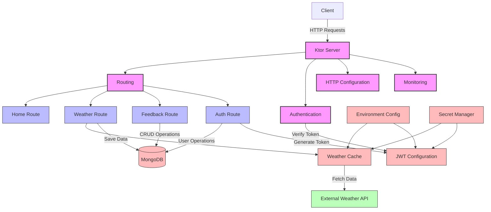

# Architecture Diagram

This architecture diagram illustrates the main components of the Weatherify API and their
relationships:

## Core Components

- **Ktor Server**: The main application server that handles HTTP requests
- **Routing**: Configures the API endpoints
- **Authentication**: Handles JWT authentication
- **HTTP Configuration**: Sets up content negotiation, headers, etc.
- **Monitoring**: Configures logging and monitoring

## Routes

- **Home Route**: Serves the interactive HTML documentation
- **Weather Route**: Provides weather and air pollution data
- **Feedback Route**: Manages user feedback
- **Auth Route**: Handles user registration and login

## Data Sources

- **MongoDB**: Stores user data, weather data, and feedback
- **External Weather API**: Provides weather and air pollution data
- **Secret Manager**: Securely stores API keys and secrets
- **Environment Config**: Provides configuration values from environment variables

## Key Interactions

1. Client sends HTTP requests to the Ktor Server
2. Routing directs requests to the appropriate route handlers
3. Authentication verifies JWT tokens for protected routes
4. Weather Route fetches data from External API via Weather Cache
5. Auth Route generates JWT tokens for authenticated users
6. Data is stored in and retrieved from MongoDB