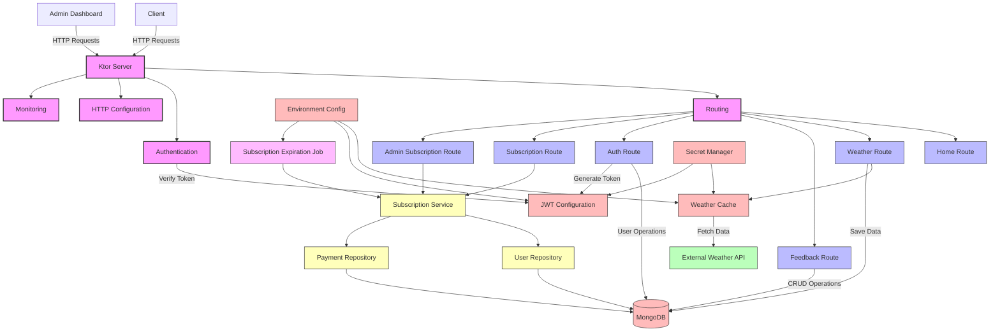

# Architecture Diagram



This architecture diagram illustrates the main components of the Weatherify API and their
relationships:

## Core Components

- **Ktor Server**: The main application server that handles HTTP requests
- **Routing**: Configures the API endpoints
- **Authentication**: Handles JWT authentication
- **HTTP Configuration**: Sets up content negotiation, headers, etc.
- **Monitoring**: Configures logging and monitoring

## Routes

- **Home Route**: Serves the interactive HTML documentation
- **Weather Route**: Provides weather and air pollution data
- **Feedback Route**: Manages user feedback
- **Auth Route**: Handles user registration and login
- **Subscription Route**: Manages user subscription status, history, and cancellation
- **Admin Subscription Route**: Provides admin access to subscription management and analytics

## Data Sources

- **MongoDB**: Stores user data, weather data, feedback, subscriptions, and payment records
- **External Weather API**: Provides weather and air pollution data
- **Secret Manager**: Securely stores API keys and secrets
- **Environment Config**: Provides configuration values from environment variables

## Services and Repositories

- **Subscription Service**: Manages subscription lifecycle, status calculation, grace periods, and analytics
- **User Repository**: Handles user data operations including subscription management
- **Payment Repository**: Provides read-only access to payment transaction records

## Background Jobs

- **Subscription Expiration Job**: Automatically processes expired subscriptions and grace period transitions

## Key Interactions

1. Client sends HTTP requests to the Ktor Server
2. Routing directs requests to the appropriate route handlers
3. Authentication verifies JWT tokens for protected routes
4. Weather Route fetches data from External API via Weather Cache
5. Auth Route generates JWT tokens for authenticated users
6. Subscription Route uses Subscription Service to manage user subscriptions
7. Admin Subscription Route provides administrative oversight of all subscriptions
8. Subscription Service coordinates between User Repository and Payment Repository
9. Subscription Expiration Job runs scheduled tasks to process expired subscriptions
10. Data is stored in and retrieved from MongoDB

---

## Feature-Based Route Registration (Scalable Architecture)

To support ongoing growth and contributions from multiple developers without changing existing
behavior, the project adopts a feature-based route registration pattern.

Key pieces:

- RouteRegistrar: a tiny contract that allows each feature to register its own routes.
- Koin module (di/RouteModule.kt): wires an ordered List<RouteRegistrar> so registration order is
  explicit and stable.
- Central router (base/Routing.kt): iterates registrars to register all routes while preserving
  redirects and catch-all 404 handling.

Why this matters:

- Decouples features from a monolithic Routing.kt file.
- New pages/features can be added by implementing a registrar (or delegating to an existing Route
  extension) and binding it in di/RouteModule.kt.
- Registration order remains deterministic (important if overlapping paths exist).

Minimal contracts (simplified):

```kotlin
// route/common/RouteRegistrar.kt
fun interface RouteRegistrar {
  fun register(root: io.ktor.server.routing.Route)
}

// route/common/Registrars.kt (delegates to existing Route extension functions)
object HomeRoutesRegistrar : RouteRegistrar {
  override fun register(r: Route) {
    with(r) { homeRoute() }
  }
}
// ... other registrars ...

// di/RouteModule.kt (ordered list)
val routeModule = module {
  single<RouteRegistrar>(named("home")) { HomeRoutesRegistrar }
  // ... other registrars ...
  single<List<RouteRegistrar>> { listOf(get(named("home")) /*, ... */) }
}

// base/Routing.kt
val registrars by inject<List<RouteRegistrar>>()
routing {
  registrars.forEach { it.register(this) }
  // existing redirects and 404 handling stay the same
}
```

Adding a new feature/page (summary):

1) Create a Ktor Route extension for the feature or reuse an existing one.
2) Add a registrar that delegates to that extension.
3) Bind it in di/RouteModule.kt and include it in the ordered list.
4) Add data/domain DI bindings if needed (repositories/services).

This pattern keeps the codebase modular, scalable, and safe for incremental evolution while ensuring
no functional changes to existing endpoints.

---

## SOLID Assessment (2025-08-17)

- Single Responsibility Principle (SRP):
  - Route registration is decoupled via RouteRegistrar objects. ✓
  - Weather cache and HTTP configuration responsibilities are centralized in util/WeatherCache. ✓
  - WeatherApiClientImpl now delegates caching and HttpClient creation to WeatherCache to avoid
    duplication. ✓
- Open/Closed Principle (OCP):
  - New routes can be added via new RouteRegistrar implementations without modifying the central
    router. ✓
  - Services and repositories can be extended by adding new implementations and wiring in DI. ✓
- Liskov Substitution Principle (LSP):
  - Interfaces (repositories, services, clients) are respected by their implementations and can be
    substituted in DI. ✓
- Interface Segregation Principle (ISP):
  - Interfaces are cohesive (WeatherApiClient, repositories, services) and do not force unused
    methods. ✓
- Dependency Inversion Principle (DIP):
  - Higher-level modules depend on abstractions (repositories/services). DI via Koin in di/*
    maintains inversion. ✓

Notes:

- util.Constants is grouped by domains and intentionally centralized for discoverability; it may be
  further split if it grows substantially, but it currently stays within SRP boundaries.
- Secret access is encapsulated in util/GCPUtil.kt and consumed via WeatherCache and auth
  configuration.
