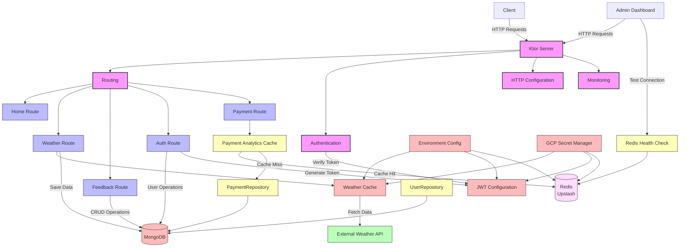

# Architecture Diagram


```mermaid
graph TD
    Client[Client] --> |HTTP Requests| Server[Ktor Server]
    AdminUI[Admin Dashboard] --> |HTTP Requests| Server
    
    %% Main Application Components
    Server --> Routing[Routing]
    Server --> Authentication[Authentication]
    Server --> HTTP[HTTP Configuration]
    Server --> Monitoring[Monitoring]
    
    %% Routes
    Routing --> HomeRoute[Home Route]
    Routing --> WeatherRoute[Weather Route]
    Routing --> FeedbackRoute[Feedback Route]
    Routing --> AuthRoute[Auth Route]
    Routing --> PaymentRoute[Payment Route]
    
    %% Weather Components
    WeatherRoute --> WeatherCache[Weather Cache]
    WeatherCache --> |Fetch Data| ExternalAPI[External Weather API]
    WeatherRoute --> |Save Data| Database[(MongoDB)]
    
    %% Auth Components
    AuthRoute --> |User Operations| Database
    AuthRoute --> |Generate Token| JWTConfig[JWT Configuration]
    Authentication --> |Verify Token| JWTConfig
    
    %% Feedback Components
    FeedbackRoute --> |CRUD Operations| Database
    
    %% Payment & Analytics Components
    PaymentRoute --> PaymentAnalyticsCache[Payment Analytics Cache]
    PaymentAnalyticsCache --> |Cache Hit| Redis[(Redis<br/>Upstash)]
    PaymentAnalyticsCache --> |Cache Miss| PaymentRepository
    PaymentRepository --> Database
    
    %% Data Access
    UserRepository --> Database
    
    %% Admin Tools
    AdminUI --> |Test Connection| RedisHealthCheck[Redis Health Check]
    RedisHealthCheck --> Redis
    
    %% Environment & Configuration
    Environment[Environment Config] --> WeatherCache
    Environment --> JWTConfig
    Environment --> Redis
    SecretManager[GCP Secret Manager] --> WeatherCache
    SecretManager --> JWTConfig
    SecretManager --> Redis
    
    %% Legend
    classDef core fill:#f9f,stroke:#333,stroke-width:2px;
    classDef route fill:#bbf,stroke:#333,stroke-width:1px;
    classDef external fill:#bfb,stroke:#333,stroke-width:1px;
    classDef data fill:#fbb,stroke:#333,stroke-width:1px;
    classDef service fill:#ffb,stroke:#333,stroke-width:1px;
    classDef cache fill:#fdf,stroke:#333,stroke-width:1px;
    classDef job fill:#fbf,stroke:#333,stroke-width:1px;
    
    class Server,Routing,Authentication,HTTP,Monitoring core;
    class HomeRoute,WeatherRoute,FeedbackRoute,AuthRoute,PaymentRoute route;
    class ExternalAPI external;
    class Database,Environment,SecretManager,JWTConfig,WeatherCache,Redis data;
    class UserRepository,PaymentRepository,PaymentAnalyticsCache,RedisHealthCheck service;
    class Redis cache;
```

This architecture diagram illustrates the main components of the Weatherify API and their
relationships:

## Core Components

- **Ktor Server**: The main application server that handles HTTP requests
- **Routing**: Configures the API endpoints
- **Authentication**: Handles JWT authentication
- **HTTP Configuration**: Sets up content negotiation, headers, etc.
- **Monitoring**: Configures logging and monitoring

## Routes

- **Home Route**: Serves the interactive HTML documentation
- **Weather Route**: Provides weather and air pollution data
- **Feedback Route**: Manages user feedback
- **Auth Route**: Handles user registration and login

## Data Sources

- **MongoDB**: Stores user data, weather data, feedback, and payment records
- **Redis (Upstash)**: Caches payment analytics queries and admin dashboard data
- **External Weather API**: Provides weather and air pollution data
- **GCP Secret Manager**: Securely stores API keys and secrets (redis-url, weather-api-key, JWT secret, etc.)
- **Environment Config**: Provides configuration values from environment variables or Secret Manager

## Services and Repositories

- **User Repository**: Handles user data operations
- **Payment Repository**: Provides read-only access to payment transaction records
- **Payment Analytics Cache**: Caches expensive aggregation queries (totals, monthly revenue, counts) with Redis fallback to MongoDB

## Key Interactions

1. Client sends HTTP requests to the Ktor Server
2. Routing directs requests to the appropriate route handlers
3. Authentication verifies JWT tokens for protected routes
4. Weather Route fetches data from External API via Weather Cache
5. Auth Route generates JWT tokens for authenticated users
6. Payment Route uses Payment Analytics Cache to serve admin dashboard data (via Redis with MongoDB fallback)
7. Admin Dashboard can test Redis connection via health check tool
8. All secrets fetched from GCP Secret Manager with environment variable fallback

---

## Feature-Based Route Registration (Scalable Architecture)

To support ongoing growth and contributions from multiple developers without changing existing
behavior, the project adopts a feature-based route registration pattern.

Key pieces:

- RouteRegistrar: a tiny contract that allows each feature to register its own routes.
- Koin module (di/RouteModule.kt): wires an ordered List<RouteRegistrar> so registration order is
  explicit and stable.
- Central router (base/Routing.kt): iterates registrars to register all routes while preserving
  redirects and catch-all 404 handling.

Why this matters:

- Decouples features from a monolithic Routing.kt file.
- New pages/features can be added by implementing a registrar (or delegating to an existing Route
  extension) and binding it in di/RouteModule.kt.
- Registration order remains deterministic (important if overlapping paths exist).

Minimal contracts (simplified):

```kotlin
// route/common/RouteRegistrar.kt
fun interface RouteRegistrar {
  fun register(root: io.ktor.server.routing.Route)
}

// route/common/Registrars.kt (delegates to existing Route extension functions)
object HomeRoutesRegistrar : RouteRegistrar {
  override fun register(r: Route) {
    with(r) { homeRoute() }
  }
}
// ... other registrars ...

// di/RouteModule.kt (ordered list)
val routeModule = module {
  single<RouteRegistrar>(named("home")) { HomeRoutesRegistrar }
  // ... other registrars ...
  single<List<RouteRegistrar>> { listOf(get(named("home")) /*, ... */) }
}

// base/Routing.kt
val registrars by inject<List<RouteRegistrar>>()
routing {
  registrars.forEach { it.register(this) }
  // existing redirects and 404 handling stay the same
}
```

Adding a new feature/page (summary):

1) Create a Ktor Route extension for the feature or reuse an existing one.
2) Add a registrar that delegates to that extension.
3) Bind it in di/RouteModule.kt and include it in the ordered list.
4) Add data/domain DI bindings if needed (repositories/services).

This pattern keeps the codebase modular, scalable, and safe for incremental evolution while ensuring
no functional changes to existing endpoints.

---

## Redis Caching Layer (Upstash Integration)

### Overview
Redis caching is integrated via Upstash cloud service to reduce database load from expensive aggregation queries, particularly payment analytics on the admin dashboard. The implementation uses a graceful degradation pattern where Redis is optional—if unavailable, the application falls back to direct MongoDB queries.

### Cache Topology

**Cache Layer**: `PaymentAnalyticsCache` (util/RedisCache wrapper)
- Wraps expensive MongoDB aggregations
- Caches results with appropriate TTLs (30min - 2 hours)
- Automatically invalidates on payment/refund operations
- Uses key prefix pattern for bulk invalidation (`analytics:*`)

**Cached Queries**:
```
analytics:total-revenue                               → Double (30 min TTL)
analytics:verified-aggregate                          → Long, Long pair (30 min TTL)
analytics:monthly-revenue:YYYY-MM-DD:YYYY-MM-DD      → List<MonthlyRevenue> (2 hour TTL)
analytics:count-by-status                             → Map<String, Long> (30 min TTL)
analytics:count-by-service                            → Map<String, Long> (1 hour TTL)
analytics:service-analytics:SERVICE_CODE              → Service stats + monthly breakdown (2 hour TTL)
```

### Secret Management Integration

Redis connection details are managed via `GCPUtil.getSecretValue("redis-url")`, following the same pattern as other secrets:

**Priority Order**:
1. **Environment Variable** (`REDIS_URL`) — Best for Cloud Run, Docker
2. **GCP Secret Manager** (`redis-url` secret) — Secure production access via GOOGLE_CLOUD_PROJECT
3. **Local Fallback** (empty string) — Disables caching for local dev without Redis

**Cloud Run Example**:
```bash
# Create secret in GCP
gcloud secrets create redis-url --data-file=- <<< "rediss://..."

# Grant service account access
gcloud secrets add-iam-policy-binding redis-url \
  --member=serviceAccount:YOUR_SA@YOUR_PROJECT.iam.gserviceaccount.com \
  --role=roles/secretmanager.secretAccessor

# Deploy with GCP_PROJECT_ID (automatically fetches redis-url)
gcloud run deploy api --set-env-vars GCP_PROJECT_ID=YOUR_PROJECT
```

### Upstash Quota Analysis

**Free Tier Limits**: 256 GB storage, 10 GB monthly commands (100K commands/day)

**Current Usage**:
- **Storage**: ~10 KB concurrent (0.00001% of limit) ✅
- **Monthly Commands**: ~35K commands (0.35% of limit) ✅
- **Scaling**: Can handle 100x traffic (3.5M commands/month) before approaching limits

### Health Check Tool

Admin dashboard includes Redis health check utility:
- **Location**: Admin Dashboard → Tools tab → "Redis Health Check"
- **Functionality**: Tests set/get operations, measures latency
- **Endpoint**: `POST /tools/redis-health` (admin-only)
- **Response**: Status, latency, timestamp, error details

### Graceful Degradation

If Redis is unavailable or `REDIS_URL` is unset:
- All `redisCache.get()` calls return `null`
- All `redisCache.set()` calls are no-ops
- Application automatically falls back to live MongoDB queries
- Admin dashboard remains fully functional (no errors)
- Logging at WARN level documents cache misses

**Code Example**:
```kotlin
suspend fun getTotalRevenue(): Result<Double> {
    val key = "analytics:total-revenue"
    redis.get(key)?.let { cached ->
        return Result.success(cached.toDouble())  // Cache hit
    }
    // Cache miss or Redis unavailable → query MongoDB
    return paymentRepository.getTotalRevenue().also { result ->
        if (result is Result.Success) {
            redis.set(key, result.data.toString(), TTL_TOTALS)  // No-op if Redis unavailable
        }
    }
}
```

### Implementation Details

**Files**:
- `src/main/kotlin/util/RedisCache.kt` — Lettuce-based Redis wrapper with async/coroutine support
- `src/main/kotlin/data/service/PaymentAnalyticsCache.kt` — Business logic for payment caching
- `src/main/kotlin/util/GCPUtil.kt` — Secret retrieval (environment variables or GCP Secret Manager)
- `src/main/resources/web/js/redis-health-check.js` — Admin UI for testing connection
- `src/main/resources/web/css/redis-health-check.css` — Styling for health check results

**Dependencies**:
- `io.lettuce:lettuce-core:6.3.2.RELEASE` — Async Redis client (in build.gradle.kts)

---

## SOLID Assessment (2025-08-17)

- Single Responsibility Principle (SRP):
  - Route registration is decoupled via RouteRegistrar objects. ✓
  - Weather cache and HTTP configuration responsibilities are centralized in util/WeatherCache. ✓
  - WeatherApiClientImpl now delegates caching and HttpClient creation to WeatherCache to avoid duplication. ✓
  - Redis caching wrapped in PaymentAnalyticsCache with clear separation from business logic. ✓
  - Secret retrieval centralized in util/GCPUtil.kt (environment variables or GCP Secret Manager). ✓
- Open/Closed Principle (OCP):
  - New routes can be added via new RouteRegistrar implementations without modifying the central router. ✓
  - Services and repositories can be extended by adding new implementations and wiring in DI. ✓
  - PaymentAnalyticsCache can adopt additional caching strategies without code changes. ✓
- Liskov Substitution Principle (LSP):
  - Interfaces (repositories, services, clients) are respected by their implementations and can be substituted in DI. ✓
  - RedisCache and PaymentAnalyticsCache work seamlessly with or without Redis available. ✓
- Interface Segregation Principle (ISP):
  - Interfaces are cohesive (WeatherApiClient, repositories, services, caches) and do not force unused methods. ✓
- Dependency Inversion Principle (DIP):
  - Higher-level modules depend on abstractions (repositories/services/caches). DI via Koin in di/* maintains inversion. ✓

Notes:

- util.Constants is grouped by domains and intentionally centralized for discoverability; it may be further split if it grows substantially, but it currently stays within SRP boundaries.
- Secret access is encapsulated in util/GCPUtil.kt with graceful fallback (env vars → GCP Secret Manager → local defaults).
- Redis caching is optional and gracefully degrades (all operations no-op if unavailable).

---

## Premium Features Architecture (Planned)

### Overview
Premium features extend the core weather functionality with advanced analytics, personalization, and health integration. All premium features are gated by `SubscriptionFeature` checks and return 403 Forbidden for non-premium users.

### Feature Categories & Data Models

#### 1. Weather Analytics & Comparison
**Features**: Multi-location comparison, historical trends, weather predictions

**New Models**:
```kotlin
// Weather trend aggregation
data class WeatherTrend(
    val locationId: ObjectId,
    val date: String,
    val avgTemperature: Double,
    val avgHumidity: Double,
    val avgPressure: Double,
    val totalPrecipitation: Double,
    val recordedAt: String
)

// Weather comparison snapshot
data class WeatherComparison(
    val userId: ObjectId,
    val locations: List<LocationWeatherSnapshot>,
    val comparedAt: String
)
```

**New Routes**:
- `GET /api/premium/weather/trends?locationId={id}&days={30|60|90}`
- `GET /api/premium/weather/comparison?locationIds={id1},{id2},...`
- `GET /api/premium/weather/historical?locationId={id}&date={YYYY-MM-DD}`

**Implementation Notes**:
- Leverage existing MongoDB aggregate pipeline for trend calculations
- Cache 7-day trends in Redis for performance
- Historical data retention: 2 years minimum

---

#### 2. Smart Alerts & Notifications
**Features**: Customizable weather alerts, threshold-based notifications, location-specific rules

**New Models**:
```kotlin
data class WeatherAlert(
    val userId: ObjectId,
    val id: ObjectId = ObjectId(),
    val alertType: AlertType, // TEMPERATURE, RAIN, WIND, UV, POLLEN, SEVERE
    val threshold: Double,
    val comparison: ComparisonOperator, // GT, LT, EQ
    val locationIds: List<ObjectId>, // Multiple saved locations
    val notificationHours: List<Int>?, // [6, 18] = 6am & 6pm only
    val isActive: Boolean = true,
    val createdAt: String = Instant.now().toString(),
    val updatedAt: String = Instant.now().toString()
)

enum class AlertType {
    TEMPERATURE, RAIN, WIND, UV, POLLEN, SEVERE
}

enum class ComparisonOperator {
    GT, LT, EQ, GTE, LTE
}

// Alert trigger log for analytics
data class AlertTriggerLog(
    val userId: ObjectId,
    val alertId: ObjectId,
    val triggeredAt: String,
    val weatherValue: Double,
    val notificationSent: Boolean
)
```

**New Routes**:
- `POST /api/premium/alerts` - Create alert
- `GET /api/premium/alerts` - List user alerts
- `PUT /api/premium/alerts/{alertId}` - Update alert
- `DELETE /api/premium/alerts/{alertId}` - Delete alert
- `GET /api/premium/alerts/history?days={7|30}` - View triggered alerts

**Implementation Notes**:
- Use scheduled jobs (Quartz) to check alerts every 30 minutes
- Batch notification delivery via FCM
- Alert throttling: Max 3 similar alerts per hour

---

#### 3. Activity Planning & Recommendations
**Features**: Optimal activity times, suitability scoring, workout recommendations

**New Models**:
```kotlin
data class ActivityRecommendation(
    val userId: ObjectId,
    val activityType: ActivityType, // RUNNING, HIKING, CYCLING, SWIMMING, OUTDOOR_WORKOUT
    val locationId: ObjectId,
    val recommendedTime: String, // HH:mm format
    val suitabilityScore: Float, // 0-100
    val weatherFactors: Map<String, String>, // "temperature": "optimal", "wind": "strong"
    val warnings: List<String>, // ["High UV index", "Strong winds"]
    val forecastedFor: String, // Date
    val createdAt: String = Instant.now().toString()
)

enum class ActivityType {
    RUNNING, HIKING, CYCLING, SWIMMING, OUTDOOR_WORKOUT
}

// User activity preferences (saved for ML/personalization)
data class ActivityPreference(
    val userId: ObjectId,
    val activityType: ActivityType,
    val preferredTemperatureRange: IntRange, // 15..25 Celsius
    val maxWindSpeed: Int, // km/h
    val minVisibility: Int, // km
    val avoidRain: Boolean,
    val preferredHours: List<Int> // [6, 7, 18, 19] = early morning or evening
)
```

**New Routes**:
- `GET /api/premium/activities/recommendations?locationId={id}&date={YYYY-MM-DD}`
- `POST /api/premium/activities/preferences` - Save preferences
- `GET /api/premium/activities/preferences`

**Recommendation Algorithm**:
1. Fetch forecast for location & date
2. Score each activity type (0-100) based on:
   - Temperature suitability
   - Precipitation probability
   - Wind speed
   - UV index
   - Visibility
3. Find optimal time window (best 2-hour window)
4. Compare against user preferences

---

#### 4. Health Integration
**Features**: Allergy tracking, health alerts, air quality impact

**New Models**:
```kotlin
data class HealthProfile(
    val userId: ObjectId,
    val allergies: List<String>, // ["pollen", "dust", "pet dander"]
    val medicalConditions: List<String>, // ["asthma", "heart disease"]
    val medicationReminders: List<MedicationReminder>
)

data class MedicationReminder(
    val medicationName: String,
    val triggerAt: PollenLevel, // LOW, MODERATE, HIGH, VERY_HIGH
    val dosage: String,
    val notes: String?
)

// Health advisory system
data class HealthAdvisory(
    val userId: ObjectId,
    val advisoryType: String, // "allergy", "asthma", "exercise_caution"
    val severity: String, // "low", "moderate", "high"
    val message: String,
    val recommendations: List<String>,
    val validFrom: String,
    val validUntil: String
)

// Monthly health report
data class HealthReport(
    val userId: ObjectId,
    val month: String, // "2025-04"
    val avgAirQuality: Float,
    val pollenExposureDays: Int,
    val allergicSymptomDays: Int,
    val recommendedActivityDays: Int,
    val healthScore: Float // 0-100
)
```

**New Routes**:
- `POST /api/premium/health/profile` - Save health profile
- `GET /api/premium/health/profile` - Get profile
- `GET /api/premium/health/advisories` - Get current health advisories
- `GET /api/premium/health/reports/{month}` - Get monthly health report

**Implementation Notes**:
- Daily health advisory generation via scheduled job
- Integrate with pollen API endpoints
- HIPAA compliance for health data storage

---

#### 5. Weather Journal & Analytics
**Features**: Personal weather logs, memory photos, statistics

**New Models**:
```kotlin
data class WeatherEntry(
    val userId: ObjectId,
    val id: ObjectId = ObjectId(),
    val locationId: ObjectId,
    val date: String, // YYYY-MM-DD
    val observations: String, // User's observations
    val mood: String?, // "happy", "sad", "energetic", etc.
    val photoUrls: List<String>?, // User photos with timestamp
    val weather: WeatherSnapshot?, // Snapshot of actual weather
    val tags: List<String>?, // ["hiking", "sunset", "storm"]
    val createdAt: String = Instant.now().toString(),
    val updatedAt: String = Instant.now().toString()
)

// Monthly/yearly statistics
data class WeatherStatistics(
    val userId: ObjectId,
    val period: String, // "2025-04" or "2025"
    val hottestDay: Double,
    val coldestDay: Double,
    val rainiestDay: Double,
    val sunniestDays: Int,
    val stormyDays: Int,
    val averageTemperature: Double,
    val totalPrecipitation: Double,
    val mostCommonWeather: String
)
```

**New Routes**:
- `POST /api/premium/journal/entries` - Create entry
- `GET /api/premium/journal/entries?month={YYYY-MM}` - List entries
- `PUT /api/premium/journal/entries/{entryId}` - Update entry
- `DELETE /api/premium/journal/entries/{entryId}` - Delete entry
- `GET /api/premium/journal/statistics/{period}` - Get stats

**Implementation Notes**:
- Photo storage: AWS S3 with signed URLs
- Monthly statistics calculated via scheduled job
- Duplicate photo detection (prevent duplicate uploads)

---

### Database Schema Extensions

**New Collections**:
- `weather_trends` - Historical trend data
- `weather_alerts` - User alert configurations
- `activity_recommendations` - Generated recommendations
- `health_profiles` - User health information
- `health_advisories` - Generated advisories
- `weather_entries` - Journal entries
- `weather_statistics` - Aggregated statistics
- `alert_trigger_logs` - Alert history

**Indexes for Performance**:
```kotlin
// weather_trends
db.weather_trends.createIndex({ "userId": 1, "date": -1 })

// weather_alerts
db.weather_alerts.createIndex({ "userId": 1, "isActive": 1 })

// weather_entries
db.weather_entries.createIndex({ "userId": 1, "date": -1 })

// activity_recommendations
db.activity_recommendations.createIndex({ "userId": 1, "forecastedFor": 1 })

// health_advisories
db.health_advisories.createIndex({ "userId": 1, "validUntil": 1 })
```

---

### Integration with Existing Systems

#### Authentication & Authorization
- All premium routes use existing JWT auth
- SubscriptionFeatureResolver checks `isPremiumActive()` on User
- Return 403 with message "Premium subscription required"

#### Payment Integration
- New payment tier in `ServiceCatalogRoute`
- Payment creates/updates premium subscription via `PaymentRoute`
- `PaymentRoute` updates user's `isPremium` and `premiumExpiresAt`

#### Admin Dashboard
- New admin tabs for:
  - Alert management (view active alerts, trigger logs)
  - User health profiles (GDPR-compliant access)
  - Activity recommendation generation (manual trigger)
  - Journal/statistics reports

#### Monitoring & Analytics
- Track premium feature adoption
- Monitor alert trigger frequency (detect spam/misconfiguration)
- Health report generation performance metrics

---

### Implementation Roadmap

**Phase 1 (High Priority)**: 
- Smart Alerts system (most requested feature)
- Activity recommendations (high engagement driver)

**Phase 2 (Medium Priority)**:
- Weather trends & analytics
- Health integration basics

**Phase 3 (Lower Priority)**:
- Weather journal
- Advanced statistics & reporting

---

### Implemented Dependencies
- **Redis (Upstash)**: ✅ Caching for payment analytics queries via Lettuce client

### Future Dependencies (If Needed)
- **Quartz**: Scheduled job execution for alerts & advisory generation
- **AWS S3 SDK**: Photo storage for journal entries
- **Pollen API**: Allergy/health integration
