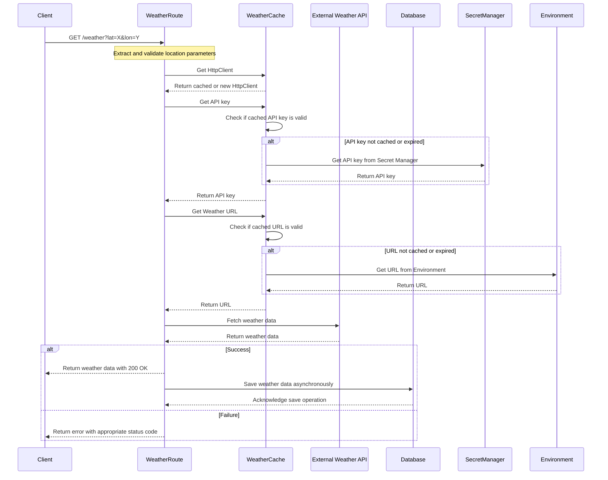
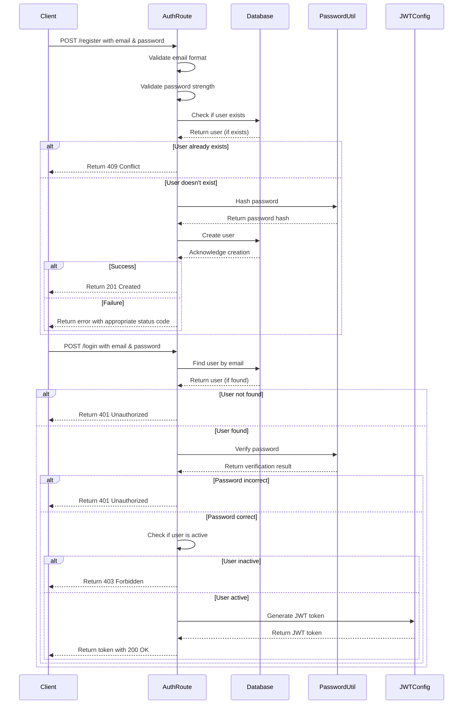
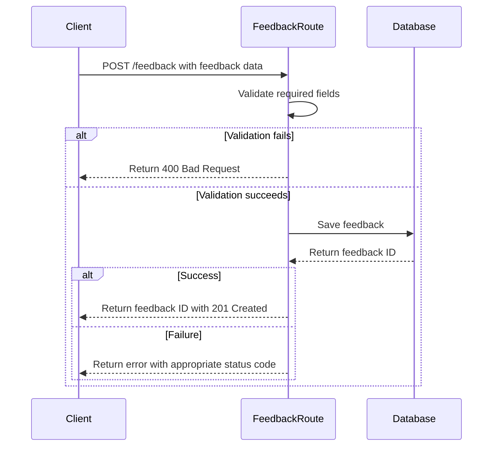

# Data Flow Diagrams

This document illustrates the key data flows in the Weatherify API.

## Weather Data Retrieval Flow

## Authentication Flow

## Feedback Submission Flow

These diagrams illustrate the key data flows in the application, showing how data moves between
different components and the decision points in each process.